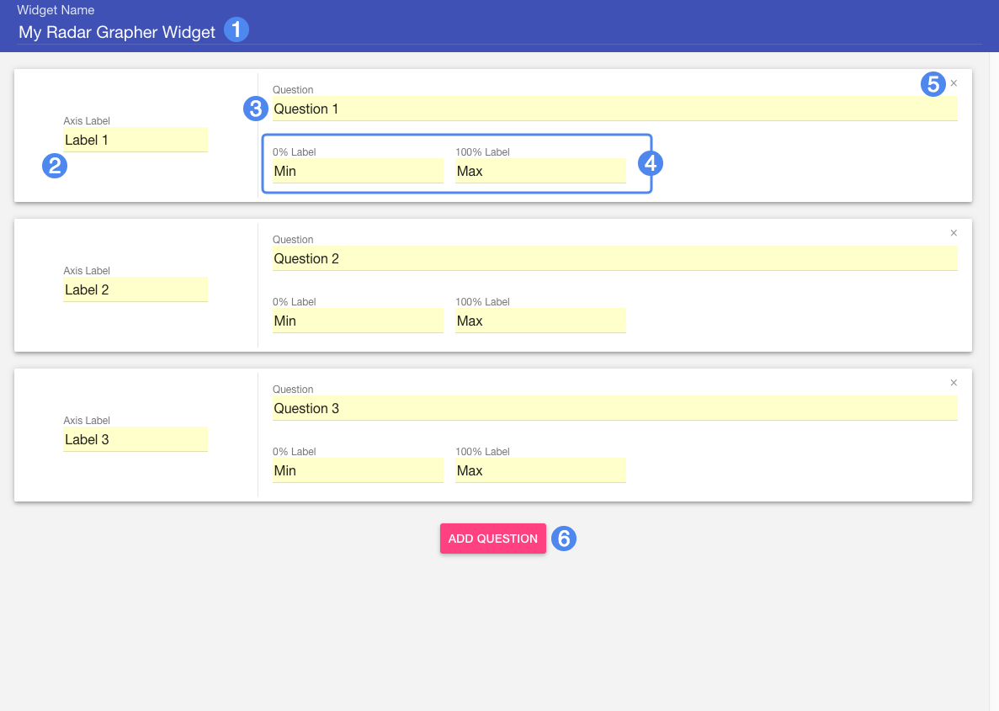
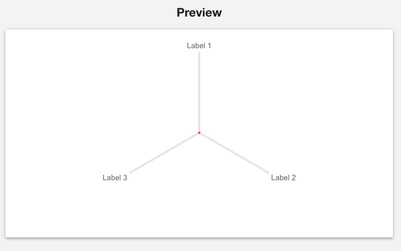

# Creator Guide #

## Overview ##

Radar Grapher is an unscored activity that asks students to respond to a series of questions by moving a corresponding slider. Once all questions are answered, the student can view their responses plotted on a radar graph.

1. Widget title
2. Title of Axis
3. Question Text
4. Min and Max value labels
5. Remove this question/axis
6. Add a new question/axis

## Details ##

Radar Grapher is an unscored activity: students will not be assessed based on how they answer. Each question should be phrased in a manner that allows for responses along a range: for example, agreement with an opinion or statement.

Note that the **Question** text will prompt the student with a question but will not be displayed in the final radar graph. Use the **Axis Label** text to assign a label that refers to the question in a condensed way. Use the **0%** and **100%** labels to provide contextual minimum and maximum values for the range of a student's response.

As an example, perhaps a question might say "How extroverted are you?" The Axis Label could be abbreviated as "Extroverted" and the minimum and maximum labels could be "Extremely" and "Not at all", or something similar.

### Graph Preview ###

On widescreen monitors and devices, the creator will include a preview of the generated radar graph. Use this preview to get a sense of what the final graph might look like. Use the sliders to experiment with different values. Note the sliders have no effect on the content of the question and are simply provided for preview purposes.