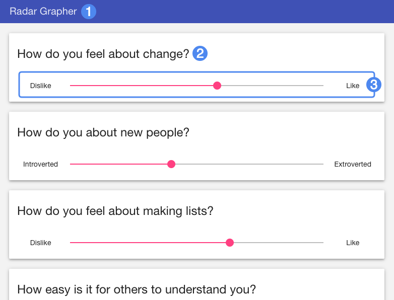
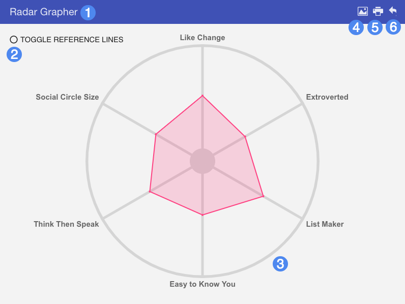

# Player Guide #

## Overview ##

Radar Grapher is an unscored activity that asks students to respond to a series of questions by moving a corresponding slider. Once all questions are answered, the student can view their responses plotted on a radar graph.

1. Widget title
2. Question text
3. Response slider

## Details ##

Upon loading the widget, students must first complete a questionnaire by moving sliders pertaining to each question. Each slider should have contextual labels representing the range of response, such as "Like" and "Dislike", or "Agree" and "Disagree". Move the slider based on your response to each question. Once all question sliders have been interacted with, click "Submit" at the bottom to view the generated radar graph.

1. Widget title
2. Reference line toggle
3. Generated radar graph
4. Download a screenshot of the generated graph
5. Print a copy of the generated graph
6. Go back to the questionnaire